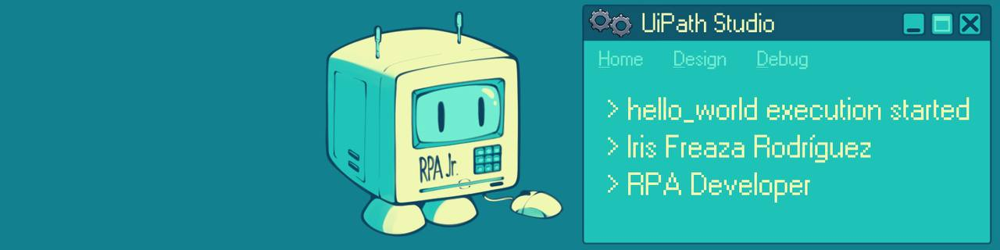

Hi there! 👋  
I'm Iris, an aspiring <b>RPA Developer</b> with strong skills in UiPath currently working on personal automation projects 💻✨ 

# About me
- Recently completed a <b>200-hour RPA bootcamp</b> by Generation Spain
- Experienced in <b>UiPath</b>, including <b>State Machines</b> and <b>REFramework</b> architectures
- Learning daily and preparing for the <b>RPA Developer Advanced Certification</b>
- <b>C1 level in English</b> - and improving every day
- Interested in <b>automation design</b>, <b>data visualization</b> and <b>ethical AI</b>

# What I work with
- UiPath Studio (State Machines, REFramework)
- UiPath Orchestrator
- draw.io + learning bizagi
- Git & GitHub for version control

# Updated Projects
- <b>Password Checker</b> 🔐
   Automated password evaluation via the Kaspersky Password Checker website  
- <b>Smart Café Station</b> ☕
   Eager for a cup of coffee? This automated solution is ready to order it for you  
- <b>Find Your Book</b> (WIP - coming soon 🚀)
   Automated search of books  - shop at your local bookstores, or find your books at your closest public library! 📚💚
  
# Let's connect!
- <a href="https://linkedin.com/in/irisfrro">LinkedIn</a>
- <a href="https://github.com/reinarins">GitHub</a>
